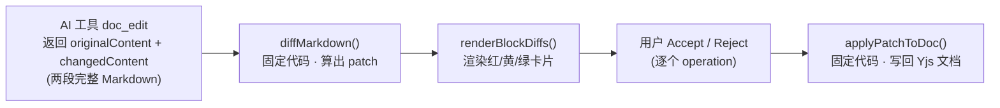

# AFFiNE Diff 实现源码解析 · 与 Next-Step Iter D（v2）对照

<aside>
🧭

**这页是什么**：基于 AFFiNE 仓库（[toeverything/AFFiNE](https://github.com/toeverything/AFFiNE)，`canary` 分支）真实源码，拆解它的 AI 文档 diff 是怎么实现的，并对照本工程 Next-Step **Iter D（v2）** 的块级 Diff + HITL 设计，供 Claude Code 转交参考。

**结论先行**：AFFiNE 的 diff 是**固定的确定性代码**算出来的，不是 AI 算的。

</aside>

## 一句话结论

**AFFiNE 的 diff 由固定代码 `diffMarkdown()` 计算，不是 AI 算的。** AI 只负责把改写后的**整段 Markdown**吐出来；"哪块改 / 删 / 加、红黄绿怎么标"全部由确定性本地函数计算。接受（Accept）后写回文档，也是固定代码 `applyPatchToDoc()` 完成。

## 整条链路（5 个环节）



### ① AI 的输出：不是 diff，是"原文 + 新文"

`doc_edit` 工具返回结构：

```tsx
result: { op, updates, originalContent, changedContent }[]
```

AI 给的是 `originalContent`（原始整段 Markdown）和 `changedContent`（改写后整段 Markdown），**它没有给"第3块删、第5块改"这种 diff**。AI 干的是"重写"，不是"打补丁"。

### ② 关键魔法：每个块都带隐藏的 `block_id`

AFFiNE 在 Markdown 里给**每个块塞了一个 HTML 注释标记**（类似 `<!-- block_id=001 flavour=paragraph -->`），渲染给用户时再用 `removeMarkdownComments()` 擦掉。`parseMarkdownToBlocks()` 靠这个标记把整段 Markdown 切成结构化块数组：

```tsx
type Block = { id: string; type: string; content: string }
```

AI 改写时会**保留没动的块的 id**，所以系统能精确知道"哪个块还是哪个块"。

### ③ 固定算法 `diffMarkdown()`：按 ID 匹配，不是按文本相似度

`diffBlockLists()` 逻辑朴素、全确定性：

- 遍历**新块**：id 在旧块存在 → 内容变了标 `replace`，没变跳过；id 不存在 → 标 `insert`（记 `after` = 前一块 id）。
- 遍历**旧块**：id 在新块没了 → 标 `delete`。

产出 `PatchOp[]`：

```tsx
| { op: 'replace'; id; content }
| { op: 'delete'; id }
| { op: 'insert'; index; after; block }
```

**纯函数、可重放、零随机性** —— 这就是"固定的代码"。可靠的根因是**靠稳定 block_id 匹配**，而非猜文本相似度。

### ④ 渲染：把 patch 翻译成红黄绿卡片

`renderBlockDiffs()` 按 op 出样式：

| op | 显示 | 颜色 |
| --- | --- | --- |
| replace | Original / Modified 上下对照 | 红底（原文）+ 黄底（新文） |
| delete | Deleted | 红底 |
| insert | Inserted | 黄/绿高亮 |

每个操作卡片挂 **Accept / Reject**（外加 Apply / Copy / Collapse），即 HITL 人审入口。另有 `generateRenderDiff()` 把 patch 整理成 `{ deletes, inserts, updates }` 三个 map，并**把连续 insert 归并到同一锚点块下**，专供"行内就地高亮"渲染。

### ⑤ Accept 落地：`applyPatchToDoc()` 改 Yjs 文档树

接受后直接操作 BlockSuite 文档模型，而非拼字符串：

- `delete` → `doc.deleteBlock(id)`
- `replace` → `replaceFromMarkdown(...)`，**复用原 block 的 id 和 index**
- `insert` → `insertFromMarkdown(...)` 插到指定 index

操作对象是第一个 `affine:note` 块的 children。底层是 Yjs（CRDT），撤销/重做/协同由 BlockSuite 框架兜底，**该 AI 模块自己不维护版本表**。

## 人话总结它的"哲学"

<aside>
💡

**AI 负责"想"，固定代码负责"算账"和"动手"。**

AI 重写整篇文档（每个块都戴身份证 block_id）→ 本地代码靠身份证逐块对账，算出加/删/改 → 渲染成可逐块接受/拒绝的卡片 → 用户点接受，本地代码精准改文档树。

好处：**AI 再怎么瞎写，diff 判定和落盘都确定、可控、可审计**，不会因模型抖动误删内容。

</aside>

## 源码索引（canary 分支）

- 原始仓库：[toeverything/AFFiNE](https://github.com/toeverything/AFFiNE) —— 用户提供的原链接，本页全部分析基于此仓库 `canary` 分支
- [`components/ai-tools/doc-edit.ts`](https://github.com/toeverything/AFFiNE/blob/canary/packages/frontend/core/src/blocksuite/ai/components/ai-tools/doc-edit.ts) —— doc_edit 工具结果渲染 + 红黄绿 diff 卡片 + Accept/Reject
- [`utils/apply-model/markdown-diff.ts`](https://github.com/toeverything/AFFiNE/blob/canary/packages/frontend/core/src/blocksuite/ai/utils/apply-model/markdown-diff.ts) —— **核心 diff 算法**：`parseMarkdownToBlocks` / `diffBlockLists` / `diffMarkdown`
- [`utils/apply-model/generate-render-diff.ts`](https://github.com/toeverything/AFFiNE/blob/canary/packages/frontend/core/src/blocksuite/ai/utils/apply-model/generate-render-diff.ts) —— 把 patch 整理为 deletes/inserts/updates，供行内高亮
- [`utils/apply-model/apply-patch-to-doc.ts`](https://github.com/toeverything/AFFiNE/blob/canary/packages/frontend/core/src/blocksuite/ai/utils/apply-model/apply-patch-to-doc.ts) —— Accept 后把 patch 写回 Yjs 文档
- [`components/ai-tools/section-edit.ts`](https://github.com/toeverything/AFFiNE/blob/canary/packages/frontend/core/src/blocksuite/ai/components/ai-tools/section-edit.ts) —— 区块级编辑结果（Insert below / Create new doc / Copy）

## 与 Next-Step Iter D（v2）对照

| 维度 | AFFiNE | Next-Step Iter D（v2） |
| --- | --- | --- |
| diff 谁来算 | 固定代码 diffMarkdown | 一致：拦截编辑工具后由代码转 diff_blocks |
| 块数据结构 | PatchOp{op:replace/delete/insert, id, content} | diff_blocks=[{id, kind:add/del/mod, tag, lines, state}] —— 几乎同构 |
| 块如何定位 | 嵌入式 block_id 按 ID 精确匹配 | InlineHighlightView 用 findSubsequence 子序列模糊锚定 |
| HITL | Accept / Reject（按 operation） | YNRD（Y接受/N拒绝/R重生/D并排），更细 |
| 暂存 | 暂存在聊天卡片，Accept 才写 | PendingChange 不写盘，全 resolve 后落盘 —— 思路一致 |
| 落地目标 | 内存里的 Yjs/CRDT 块树 | 磁盘上的纯文件（markdown/代码） |
| 版本/回退 | 靠 BlockSuite 的 Yjs 历史，无独立版本表 | ArtifactVersion 表 + 回退 + 乐观锁 If-Match |
| 降级 | 只有 Collapse/Expand | 块数 &gt;25 降级并排/unified —— 更完善 |

## 最值得借鉴的点

AFFiNE 能用"按 block_id 精确匹配"这种最稳方案，是因为**它同时控制了编辑器和 AI 输出格式**，可强制 AI 输出带 id 标记的 Markdown。而 Next-Step 是"单用户、本地、纯文件"，产物是各 Agent 写出的**任意代码/文档文件**，Agent 不会天然塞 block_id，所以用 `findSubsequence` + `oldStr→newStr` 这种**面向任意文本的补丁式匹配**反而更对。

两条可落地启发：

1. **对账（算 diff）和落盘必须是固定代码** —— 已与 AFFiNE 一致，继续坚持，别让模型直接吐 diff_blocks。
2. **把"判定/渲染/落地"彻底拆成三段纯函数**（`diffMarkdown` → `renderBlockDiffs`/`generateRenderDiff` → `applyPatchToDoc`），互不耦合、各自可单测。建议 ArtifactPanel / PendingChangeCard / resolveBlock 也照此边界切，尤其把"算 diff"做成不依赖 UI、不依赖文件系统的纯函数，方便重放和测试。

---

## 附：本次对话记录

- 原始提问与研究过程（2026-06-18）
    
    **用户提问**
    
    > 使用 raw（toeverything/AFFiNE）查看 affine 内的 diff 等功能（参考 Next-step · Iter D（v2））如何实现的，是通过固定的代码？并且用人话解释清楚其工作原理和逻辑。
    > 
    
    **研究方法**
    
    - 通过 GitHub Contents API 定位 `packages/frontend/core/src/blocksuite/ai/` 下的 AI 工具与组件目录。
    - 逐个读取 raw 源码：`copilot-tool.ts`、`components/ai-tools/doc-edit.ts`、`section-edit.ts`，以及 `utils/apply-model/` 下的 `markdown-diff.ts`、`generate-render-diff.ts`、`apply-patch-to-doc.ts`。
    
    **关键发现**
    
    1. `doc-edit.ts` 从 `utils/apply-model/markdown-diff` 导入 `diffMarkdown`，说明 diff 由前端固定代码计算。
    2. AI 工具 `doc_edit` 只返回 `originalContent` / `changedContent` 两段完整 Markdown，不返回 diff。
    3. 每个块在 Markdown 中嵌入 `block_id` 注释标记，`parseMarkdownToBlocks` 据此切块。
    4. `diffBlockLists` 按 block_id 精确匹配产出 replace/insert/delete 三类 PatchOp（确定性、纯函数）。
    5. 渲染由 `renderBlockDiffs` / `generateRenderDiff` 负责，Accept 由 `applyPatchToDoc` 写回 Yjs 文档树。
    
    **回答要点**：见本页正文。核心是"AI 负责想、固定代码负责算账和动手"，并与 Next-Step Iter D（v2）逐项对照，给出两条工程启发。